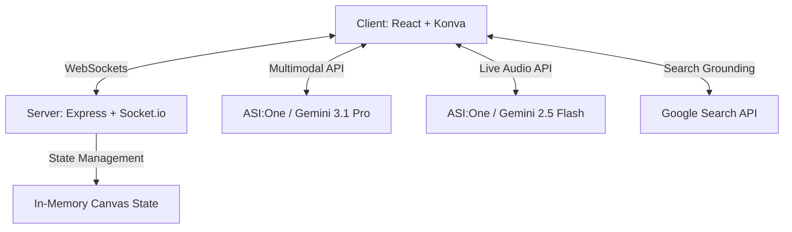

# 🚀 Nexus: The AI-Native Collaborative Studio

**Nexus Studio** is a legendary, multimodal workspace designed to revolutionize how creators, researchers, and developers build the future. By combining real-time collaboration with the full power of the **ASI:One (Gemini API)** platform, Nexus turns abstract ideas into production-ready reality in seconds.

---

## 🌟 Key Features

### 🎨 Multimodal Design-to-Code (Vision)
Nexus "sees" your workspace. Sketch a UI layout on the infinite canvas, and with one click, our **Gemini 3.1 Pro** integration generates high-fidelity React + Tailwind CSS code. 
*   **Impact**: Reduces the gap between ideation and development by 90%.

### 🎙️ Nexus Live Audio (Real-time Voice)
Experience the future of hands-free research. Powered by the **Gemini 2.5 Flash Native Audio API**, Nexus provides a low-latency, voice-activated research partner that listens to your workflow and provides instant insights.
*   **Impact**: Seamless, natural interaction without breaking your creative flow.

### 🔍 Grounded Intelligence (Search)
Never guess again. Our assistant uses **Google Search Grounding** to provide up-to-the-minute data, design trends, and technical documentation—all with verified sources.
*   **Impact**: Ensures your projects are built on a foundation of real-world, accurate data.

### 🤝 Real-time Collaborative Canvas
A high-performance, infinite whiteboard powered by **Socket.io** and **Konva**. Multiple users can brainstorm, draw, and design together with zero latency and live cursor synchronization.
*   **Impact**: True "Google Docs for Design" experience.

---

## 🛠️ Architecture

Nexus is built on a robust, full-stack architecture designed for scale and low latency.

### Tech Stack
-   **Frontend**: React 19, Vite, Tailwind CSS 4, Framer Motion, Konva.
-   **Backend**: Node.js, Express, Socket.io.
-   **AI Intelligence**: ASI:One Platform (Gemini 3.1 Pro, Gemini 3.1 Flash, Gemini 2.5 Flash Native Audio).

---

## 📱 Screen Interfaces

### 1. The Infinite Studio
A minimalist, high-contrast workspace where the canvas is the hero. Tools are tucked away in a neo-brutalist toolbar to maximize creative space.

### 2. The Nexus Assistant
A powerful, sliding sidebar that houses the multimodal intelligence. It features three modes:
-   **Chat**: General brainstorming and logic.
-   **Search**: Grounded web research with citations.
-   **Design**: Design-to-code generation from canvas snapshots.

### 3. Live Audio HUD
A non-intrusive, floating interface in the bottom-left that visualizes the AI's "listening" state and provides quick controls for the voice session.

---

## 🏆 Hackathon Alignment: ASI:One

Nexus Studio is a flagship implementation of the **ASI:One** platform's core pillars:
-   **Multimodality**: Using Vision and Audio natively.
-   **Real-time**: Leveraging low-latency inference for voice.
-   **Grounding**: Connecting AI to the live web for accuracy.

---

## 🚀 Getting Started

1.  **Clone the Repository**
2.  **Install Dependencies**: `npm install`
3.  **Set Environment Variables**: Add your `GEMINI_API_KEY` to `.env`.
4.  **Run Development Server**: `npm run dev`
5.  **Build for Production**: `npm run build`

---

## 📜 License
This project is licensed under the MIT License - see the [LICENSE](LICENSE) file for details.

---

**Built with ❤️ for API Innovate 2026.**
